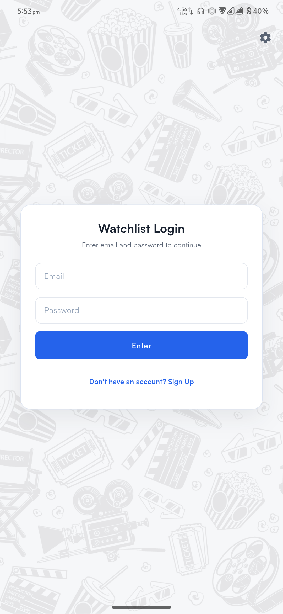
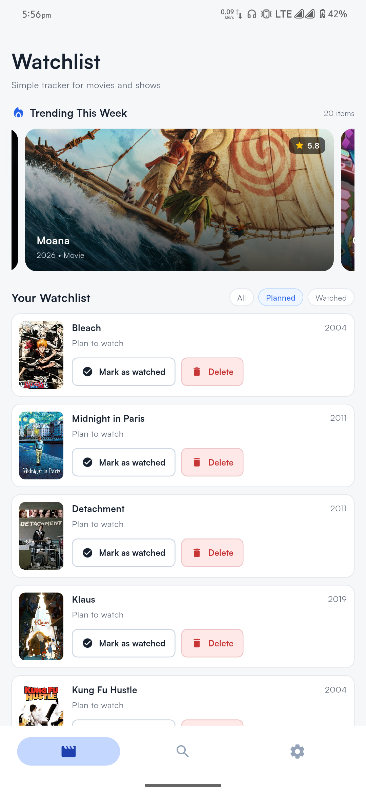
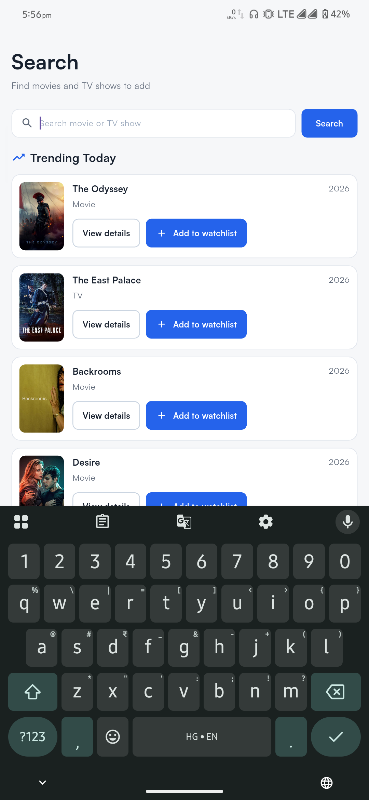
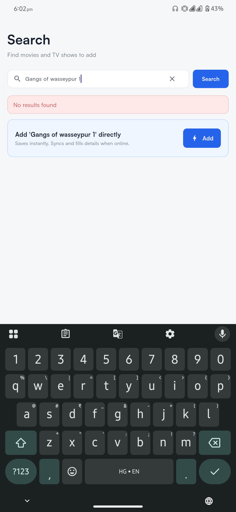
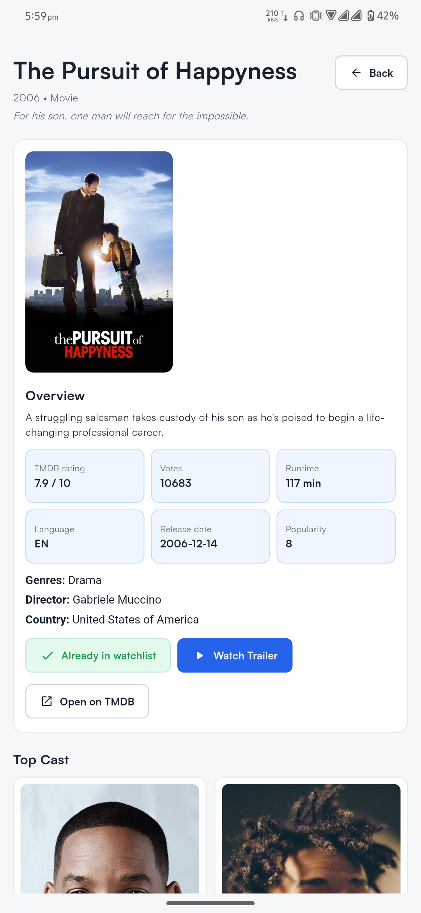
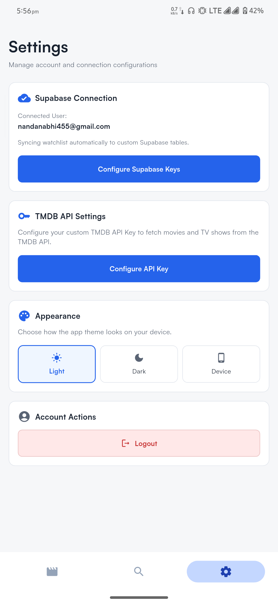

# Watchlist Application

A premium, highly-responsive Flutter mobile application designed for movie and TV show enthusiasts. It serves as a personal media dashboard to track, organize, and plan watchlists, integrating seamlessly with The Movie Database (TMDB) API and supporting sync capabilities with custom self-hosted REST backends or Supabase.

---

## 📱 Screenshots

Here is a visual showcase of the application's interface:

<p align="center">
  
  
  
</p>
<p align="center">
  
  
  
</p>

---

## ✨ Key Features

*   **📊 Comprehensive Watchlist Dashboard**: Monitor your watchlist stats at a glance, including total items, items planned to watch, items already watched, and a completion progress percentage bar.
*   **🔍 TMDB Search & Discovery**: Real-time multi-search querying TMDB for movies and TV shows, with high-quality poster images, release years, and titles.
*   **🔥 Trending Highlights**: Dynamic horizontal carousel showing this week's trending media with automated scroll transitions and beautiful parallax network backdrops, plus a "Trending Today" vertical feed.
*   **🎬 Rich Details Panel**: Displays detailed metadata for any title: Taglines, summaries, viewer ratings, release date, runtime, production countries, custom Cast profiles (actor profile pictures & role names), and recommended titles.
*   **📺 Official Trailers**: Integrated YouTube trailer extraction that attempts to launch the native YouTube mobile application using native URI schemes (`vnd.youtube:`) and falls back gracefully to standard web browsing.
*   **⚡ Supabase Integration**: Synchronize watchlist data securely to a custom Supabase database with email and password authentication.
*   **🔄 Offline-First Queued Synchronization**: Instantly executes mutations (add, delete, update status) in a local offline queue when network connections are poor or unavailable, updating the UI immediately and resolving mutations in the background.
*   **🤖 Background Auto-Enrichment**: Offline or manually added text items are automatically looked up via TMDB search endpoints in the background, matching and replacing them with full metadata, images, and TMDB IDs.
*   **🎨 Adaptive Material 3 Theming**: Responsive design supporting Dark, Light, and System modes using custom curated color palettes and the premium Satoshi font family.

---

## 🚀 Getting Started

### Prerequisites
*   [Flutter SDK](https://docs.flutter.dev/get-started/install) (v3.12.2 or higher)
*   [Dart SDK](https://dart.dev/get-dart)
*   An emulator or physical development device (Android / iOS / Web / Windows)

### 1. Installation
Clone the repository and fetch dependencies:
```bash
git clone <repository-url>
cd tmdb
flutter pub get
```

### 2. Configure Font Assets
The app relies on the Satoshi font. The typeface assets are located under `assets/fonts/` and registered inside [pubspec.yaml](file:///C:/Users/Abhinandan/Documents/Projects/Watchlist/pubspec.yaml):
```yaml
fonts:
  - family: Satoshi
    fonts:
      - asset: assets/fonts/Satoshi-Regular.ttf
      - asset: assets/fonts/Satoshi-Medium.ttf
        weight: 500
      - asset: assets/fonts/Satoshi-Bold.ttf
        weight: 700
```

### 3. Run the App
Launch the application on your default active target:
```bash
flutter run
```

---

## 🛠️ Developer Documentation

This section contains technical information regarding the architecture, codebase file structure, and database/API configurations.

### 🏗️ Technical Architecture & Under the Hood

The application is built on an offline-first, state-hydrating architecture. It decouples the UI from network latency by introducing a persistent caching layer and an offline mutation queue.

#### 1. Persistent Storage & Local Cache
All local caching is managed in [storage_service.dart](file:///C:/Users/Abhinandan/Documents/Projects/Watchlist/lib/services/storage_service.dart) using `SharedPreferences`. The app caches:
*   The last synced Watchlist database state
*   Custom TMDB API Key settings
*   Trending feeds (weekly and daily) to ensure instant rendering on application boot

#### 2. Offline Mutation Queue (PendingAction)
Whenever a user alters the watchlist (adding a show, toggling watched status, or removing a title), the application avoids blocking the UI with network requests:
1.  It instantiates a [PendingAction](file:///C:/Users/Abhinandan/Documents/Projects/Watchlist/lib/services/storage_service.dart#L290) containing the mutation type (`add`, `update_status`, or `delete`), the target ID, and the data payload.
2.  The action is saved to the local pending list in storage.
3.  The UI queries [loadWatchlistLocal()](file:///C:/Users/Abhinandan/Documents/Projects/Watchlist/lib/services/storage_service.dart#L94), which instantly merges the remote-cached watchlist with any un-synced actions, resulting in a lag-free experience.
4.  An asynchronous sync sequence is fired in the background.

#### 3. Background Synchronization Sequence
The method [syncPendingActions()](file:///C:/Users/Abhinandan/Documents/Projects/Watchlist/lib/services/storage_service.dart#L51) performs sequential queries via the `supabase_flutter` client SDK, pushing mutations (upserting, updating, or deleting rows in the `watchlist` table) associated with the currently logged-in user (`user_id`). Successfully processed actions are removed from the queue, while failed actions remain for retry during the next connection cycle.

#### 4. Auto-Enrichment Engine
Users can type and add raw text items to their watchlist when offline. Once online, [_performBackgroundSync()](file:///C:/Users/Abhinandan/Documents/Projects/Watchlist/lib/screens/home_screen.dart#L1596) runs:
1.  It identifies watchlist items lacking a `tmdbId`.
2.  For each manual item, it queries the TMDB search multi endpoint using [ApiService.searchMulti()](file:///C:/Users/Abhinandan/Documents/Projects/Watchlist/lib/services/api_service.dart#L8).
3.  If a match is found, it extracts details (correct titles, release years, cover paths, and identifiers) and builds an enriched copy of the item.
4.  It adds the enriched item, deletes the raw text placeholder, and updates both local and remote states.

#### 5. Dynamic Identity Resolution
If a user selects an item on the [HomeScreen](file:///C:/Users/Abhinandan/Documents/Projects/Watchlist/lib/screens/home_screen.dart) that hasn't been enriched yet, the [DetailsScreen](file:///C:/Users/Abhinandan/Documents/Projects/Watchlist/lib/screens/details_screen.dart) invokes [ApiService.resolveIdentity()](file:///C:/Users/Abhinandan/Documents/Projects/Watchlist/lib/services/api_service.dart#L186) to perform a real-time name/year lookup on the TMDB API, resolving details on the fly.

---

### 📂 Codebase Walkthrough

```
lib/
├── main.dart                      # App entry point, startup routing, and dynamic theme manager
├── models/
│   └── watchlist_item.dart        # WatchlistItem schema, copying, and JSON serialization
├── screens/
│   ├── login_screen.dart          # Password entry screen with settings configuration access
│   ├── home_screen.dart           # Core navigation frame (Watchlist, Search, Settings) and sync management
│   └── details_screen.dart        # Detailed page displaying media metadata, cast, and recommendations
├── services/
│   ├── api_service.dart           # Handler for querying TMDB API details, trends, and searches
│   ├── storage_service.dart       # Manager for offline caching, queueing actions, and server sync
│   └── settings.dart              # SharedPreferences manager for API configuration keys
└── widgets/
    └── server_settings_dialog.dart# Custom dialogs for adjusting Sync Server URL and TMDB API keys
```

#### Key Components Reference
*   **[main.dart](file:///C:/Users/Abhinandan/Documents/Projects/Watchlist/lib/main.dart)**: Initialises [StartupScreen](file:///C:/Users/Abhinandan/Documents/Projects/Watchlist/lib/main.dart#L89) to load the user's logged-in status and chosen theme. Implements [MyApp](file:///C:/Users/Abhinandan/Documents/Projects/Watchlist/lib/main.dart#L10) which exposes theme switching capabilities.
*   **[watchlist_item.dart](file:///C:/Users/Abhinandan/Documents/Projects/Watchlist/lib/models/watchlist_item.dart)**: Defines the [WatchlistItem](file:///C:/Users/Abhinandan/Documents/Projects/Watchlist/lib/models/watchlist_item.dart#L1) class which contains fields such as `tmdbId`, `mediaType` (`movie` or `tv`), and tracking `status` (`plan` or `watched`).
*   **[home_screen.dart](file:///C:/Users/Abhinandan/Documents/Projects/Watchlist/lib/screens/home_screen.dart)**: The central hub [HomeScreen](file:///C:/Users/Abhinandan/Documents/Projects/Watchlist/lib/screens/home_screen.dart#L14) hosting the autoscrolling weekly trending carousel and rendering tabs for search query filtering. Dispatches [_performBackgroundSync()](file:///C:/Users/Abhinandan/Documents/Projects/Watchlist/lib/screens/home_screen.dart#L1596) and handles temporary item deletion with undo functionality.
*   **[details_screen.dart](file:///C:/Users/Abhinandan/Documents/Projects/Watchlist/lib/screens/details_screen.dart)**: The [DetailsScreen](file:///C:/Users/Abhinandan/Documents/Projects/Watchlist/lib/screens/details_screen.dart#L9) fetches high-resolution descriptions and loads recommended media lists. Links YouTube trailers natively.
*   **[login_screen.dart](file:///C:/Users/Abhinandan/Documents/Projects/Watchlist/lib/screens/login_screen.dart)**: Contains the [LoginScreen](file:///C:/Users/Abhinandan/Documents/Projects/Watchlist/lib/screens/login_screen.dart#L5) verifying access codes via Supabase Auth queries.
*   **[api_service.dart](file:///C:/Users/Abhinandan/Documents/Projects/Watchlist/lib/services/api_service.dart)**: Contains [ApiService](file:///C:/Users/Abhinandan/Documents/Projects/Watchlist/lib/services/api_service.dart#L6) representing the connection proxy to TMDB API.
*   **[storage_service.dart](file:///C:/Users/Abhinandan/Documents/Projects/Watchlist/lib/services/storage_service.dart)**: Houses [StorageService](file:///C:/Users/Abhinandan/Documents/Projects/Watchlist/lib/services/storage_service.dart#L6) defining synchronization rules, local read fallbacks, and local file queue maps.
*   **[settings.dart](file:///C:/Users/Abhinandan/Documents/Projects/Watchlist/lib/services/settings.dart)**: Maintains the [Settings](file:///C:/Users/Abhinandan/Documents/Projects/Watchlist/lib/services/settings.dart#L7) class storing custom credentials for the TMDB API connection.
*   **[server_settings_dialog.dart](file:///C:/Users/Abhinandan/Documents/Projects/Watchlist/lib/widgets/server_settings_dialog.dart)**: Exposes modular dialogs [showSupabaseSettingsDialog](file:///C:/Users/Abhinandan/Documents/Projects/Watchlist/lib/widgets/server_settings_dialog.dart#L5) and [showApiKeyDialog](file:///C:/Users/Abhinandan/Documents/Projects/Watchlist/lib/widgets/server_settings_dialog.dart#L210) to customize connection configurations.

---

### ⚙️ Configuration & Customization

The app features customizable settings accessible directly within the [LoginScreen](file:///C:/Users/Abhinandan/Documents/Projects/Watchlist/lib/screens/login_screen.dart) (using the gear settings icon in the top right) or inside the Settings tab of [HomeScreen](file:///C:/Users/Abhinandan/Documents/Projects/Watchlist/lib/screens/home_screen.dart):

#### Supabase Database Sync Configuration
By default, the application is pre-configured with Supabase, executing user signup/login and persisting data on a shared instance. 

Users can override these default endpoints at runtime:
1.  Open the Settings tab in the app, and click **Configure Supabase Keys**.
2.  Enter your custom **Supabase Project URL** and **Anon Key**, and save.
3.  Relaunch or hot-restart the application to initialize Supabase with your new configuration. Leave fields blank to reset back to default fallbacks.

If you want to configure your own Supabase backend, execute the following script in your Supabase SQL Editor:

```sql
-- Create the watchlist table
create table
  watchlist (
    id uuid primary key,
    title text not null,
    year text,
    poster text,
    status text not null default 'plan',
    media_type text not null,
    tmdb_id text,
    user_id uuid references auth.users(id) on delete cascade not null,
    created_at timestamp
    with
      time zone default timezone('utc' :: text, now()) not null
  );

-- Enable Row Level Security (RLS) for data security
alter table
  watchlist enable row level security;

-- Create policy to allow users to manage their own watchlist items
create policy
  "Users can manage their own watchlist items" on watchlist for all using (auth.uid() = user_id)
with
  check (auth.uid() = user_id);
```

#### Custom TMDB API Key
If you wish to query the TMDB database under your own account limit:
1.  Obtain an API Key from [The Movie Database (TMDB)](https://www.themoviedb.org/).
2.  Open Settings in the app, click **TMDB API Settings**, enter your Key, and save.
3.  To reset to the default developer fallback key, leave the entry blank and tap **Save Key**.
